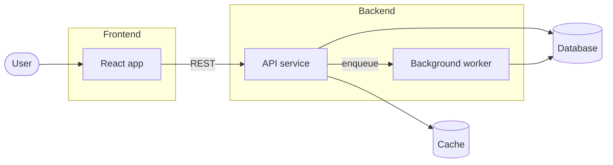
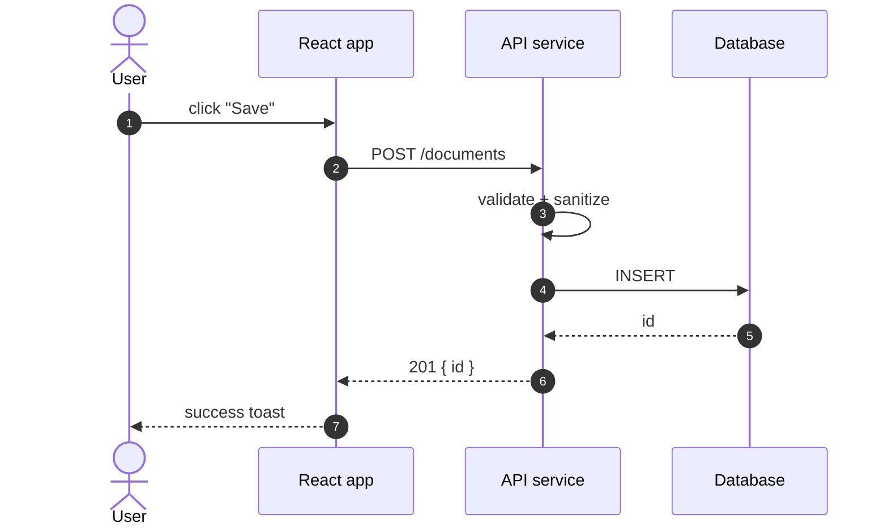
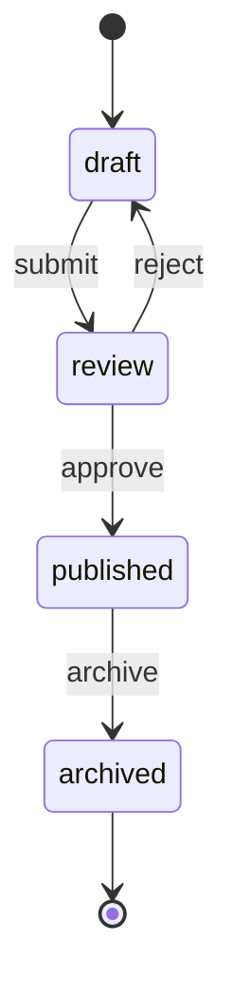
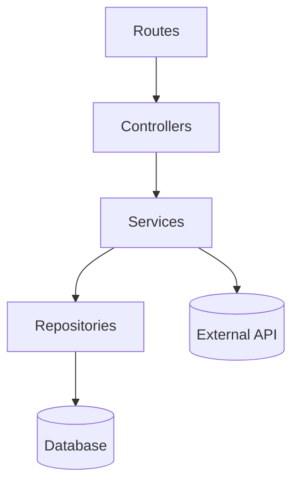
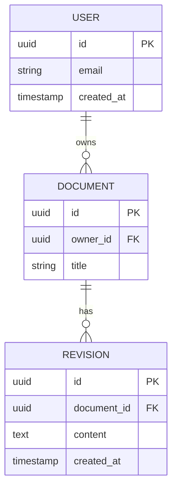

# Mermaid patterns

Recipes for the diagrams `refresh-docs` may emit. **Always validate** before writing: balanced brackets, every referenced node defined, no reserved words, single root in tree-style diagrams.

## When to use which

| Diagram | Mermaid type | Use for |
|---------|--------------|---------|
| Architecture | `flowchart LR` (or `TD` for tall) | Components and the connections between them. |
| Data flow | `sequenceDiagram` | Step-by-step lifecycle of a request/event across components. |
| State machine | `stateDiagram-v2` | Lifecycle of a domain entity with discrete states. |
| Dependencies | `flowchart TD` | Module-import or service-dependency graph. |
| Database schema | `erDiagram` | Entity relationships when ORM/SQL schema exists. |
| Class/API | `classDiagram` | Public types for SDK/library docs. Skip otherwise. |

If you cannot pick one cleanly, default to `flowchart LR` for a 2-pane architecture or `sequenceDiagram` for a request lifecycle.

## Validation rules (apply before writing)

1. Every edge endpoint must reference a node defined in the same diagram.
2. Brackets balanced: `[`/`]`, `(`/`)`, `{`/`}`, `<<`/`>>`.
3. Node IDs are unique. Use stable IDs (no spaces — `web_api` not `web api`).
4. Labels with special chars (`:`, `()`, `/`) wrapped in quotes: `A["GET /users"]`.
5. No more than ~25 nodes per diagram. If you have more, split into two diagrams or move detail to a sub-doc.
6. For `sequenceDiagram`: every `participant` referenced before first message.
7. For `erDiagram`: every entity declared with at least one attribute or `{ }`.

If any rule fails, fix it. If unfixable (e.g., the underlying structure is too complex), fall back to a Markdown table and skip the diagram.

## Architecture — `flowchart LR`

Use when describing the major components and how they connect.

Guidelines:
- Group related nodes with `subgraph`.
- Persistent stores → `[(Cylinder)]`.
- External actors → `(["Pill"])`.
- Services → `["Box"]`.
- Label edges with the protocol or trigger when non-obvious.

## Data flow — `sequenceDiagram`

Use for the request lifecycle.

Guidelines:
- Use `autonumber` for any flow with >3 messages.
- `->>` for sync calls, `-->>`  for responses, `--)` for fire-and-forget.
- Show validation/auth as a self-message: `API->>API: validate`.
- Cap at one happy path per diagram. Document errors in a separate diagram or in prose.

## State machine — `stateDiagram-v2`

Use only when the entity has discrete, observable states (e.g., job status, document lifecycle).

Guidelines:
- Always include a start (`[*] -->`) and an end (`--> [*]`) when applicable.
- Label transitions with the event that triggers them.
- Keep names lowercase to match domain terminology.

## Dependency graph — `flowchart TD`

Use to show "what imports what" or "what calls what" inside a module.

Guidelines:
- Direction `TD` reads naturally as a layered architecture.
- Don't try to show every file — group by layer or feature.
- Cyclic deps are real signal: include them but flag in the surrounding prose.

## Database schema — `erDiagram`

Use only when an ORM schema or SQL DDL exists. Pull entity names from the source; do not invent.

Cardinality cheatsheet:
- `||--o{` one to many
- `||--||` one to one
- `}o--o{` many to many
- `||--|{` one to one-or-more

## Anti-patterns

| Anti-pattern | Fix |
|--------------|-----|
| 50-node mega-diagram | Split into two: high-level + zoom-in. |
| Diagram and prose disagree | Regenerate from the same source; treat the code as source of truth. |
| Decorative diagrams that say nothing the prose doesn't | Drop the diagram. |
| Hand-drawn shapes via emoji or ASCII art in a Mermaid block | Always use real Mermaid. |
| Multiple roots in a `flowchart TD` (no clear top) | Add a synthetic root or switch to `flowchart LR`. |
| Sequence diagram with unnamed participants | Always declare `participant X as Friendly Name`. |

## When to skip diagrams entirely

- Project has <3 components — a table is clearer.
- Diagram would reproduce something already obvious from the prose.
- Underlying structure is too volatile to keep accurate (will rot before next sync).

In all those cases, prefer a Markdown table or a bullet list over a stale Mermaid diagram.
